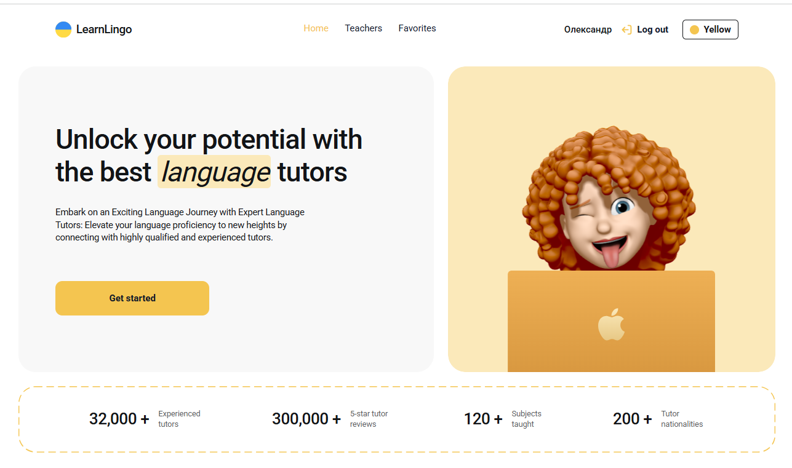
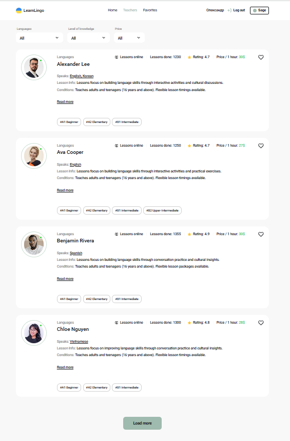
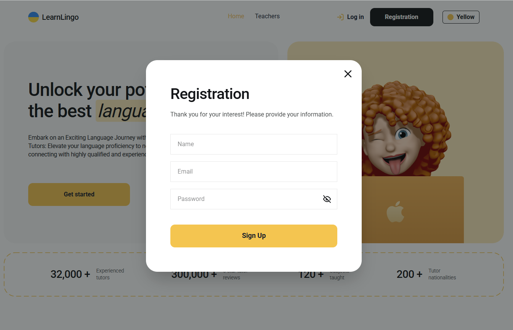

# LearnLingo

Frontend application for finding and booking language tutors online. LearnLingo includes Firebase authentication, tutor catalog filtering, favorites, booking form validation, pagination, persistent user preferences, and theme customization.

The app is built with React, Vite, Firebase, React Router, Zustand, React Hook Form, Yup, Tailwind CSS, and Framer Motion. Tutor data is loaded from Firebase Firestore, while Firebase Auth handles registration, login, logout, and persistent user sessions.

## Live Demo

- Frontend: [https://learn-lingo-liard.vercel.app](https://learn-lingo-liard.vercel.app)
- Repository: [LearnLingo](https://github.com/Oleksandr-Sulyma/LearnLingo)

## Project Materials

- Technical task: [Google Docs](https://docs.google.com/document/d/1ZB_MFgnnJj7t7OXtv5hESSwY6xRgVoACZKzgZczWc3Y/edit?tab=t.0)
- Design layout: [Figma](https://www.figma.com/file/dewf5jVviSTuWMMyU3d8Mc/%D0%9F%D0%B5%D1%82-%D0%BF%D1%80%D0%BE%D1%94%D0%BA%D1%82-%D0%B4%D0%BB%D1%8F-%D0%9A%D0%A6?type=design&node-id=0-1&mode=design&t=jCmjSs9PeOjObYSc-0)

## Preview





## Features

- User registration and login with Firebase Auth
- Persistent authentication state
- Tutor catalog loaded from Firebase Firestore
- Tutor filtering by language, student level, and hourly rate
- Paginated tutor loading with "Load more"
- Favorite tutors with Zustand persistence
- Favorites page available for authenticated users
- Booking modal with validated form fields
- Custom auth modals for login and registration
- Modal closing by close button, backdrop click, and `Esc`
- Five visual themes: Yellow, Sage, Soft Blue, Rose, and Peach
- Theme persistence with Zustand
- Toast notifications for user actions
- Responsive UI based on the provided Figma design

## Tech Stack

- React
- Vite
- Firebase Auth
- Firebase Firestore
- React Router
- Zustand
- React Hook Form
- Yup
- Tailwind CSS
- Framer Motion
- React Hot Toast
- React Select
- Vercel

## Project Structure

```text
LearnLingo/
  public/
    screenshots/
  src/
    assets/
    components/
      Auth/
      BookingForm/
      Button/
      Header/
      Modal/
      TeacherCard/
      TeacherFilters/
    context/
    firebase/
    pages/
    store/
    App.jsx
    main.jsx
    index.css
  package.json
  vite.config.js
```

## Getting Started

### 1. Clone the repository

```bash
git clone https://github.com/Oleksandr-Sulyma/LearnLingo.git
cd LearnLingo
```

### 2. Install dependencies

```bash
npm install
```

### 3. Configure environment variables

Create a `.env` file in the project root and add your Firebase configuration.

```env
VITE_FIREBASE_API_KEY=your_firebase_api_key
VITE_FIREBASE_AUTH_DOMAIN=your_project.firebaseapp.com
VITE_FIREBASE_PROJECT_ID=your_project_id
VITE_FIREBASE_STORAGE_BUCKET=your_project.firebasestorage.app
VITE_FIREBASE_MESSAGING_SENDER_ID=your_sender_id
VITE_FIREBASE_APP_ID=your_app_id
```

### 4. Run the development server

```bash
npm run dev
```

Open the local URL shown in the terminal.

## Available Scripts

| Script | Description |
| --- | --- |
| `npm run dev` | Start the Vite development server |
| `npm run build` | Build the application for production |
| `npm run preview` | Preview the production build locally |
| `npm run lint` | Run ESLint |

## Environment Variables

| Variable | Description |
| --- | --- |
| `VITE_FIREBASE_API_KEY` | Firebase API key |
| `VITE_FIREBASE_AUTH_DOMAIN` | Firebase Auth domain |
| `VITE_FIREBASE_PROJECT_ID` | Firebase project ID |
| `VITE_FIREBASE_STORAGE_BUCKET` | Firebase storage bucket |
| `VITE_FIREBASE_MESSAGING_SENDER_ID` | Firebase messaging sender ID |
| `VITE_FIREBASE_APP_ID` | Firebase app ID |

## Application Routes

| Route | Description |
| --- | --- |
| `/` | Home page |
| `/teachers` | Tutor catalog with filters and pagination |
| `/favorites` | Saved favorite tutors |

## Firebase Integration

- Firebase Auth is used for registration, login, logout, and persistent sessions.
- Firestore stores tutor data in the `teachers` collection.
- Tutor filters are built from the available Firestore data.
- Tutor pagination loads 4 cards at a time.

## State Management

| Store | Responsibility |
| --- | --- |
| `useThemeStore` | Selected visual theme and theme persistence |
| `useFavoritesStore` | Favorite tutor IDs persisted in local storage |
| `useFiltersStore` | Active tutor filters: language, level, and price |

## Architecture Notes

- React Router handles public application routes.
- Firebase Auth state is exposed through `AuthContext`.
- Tutor data fetching is isolated in `src/firebase/database.js`.
- Theme colors are controlled with CSS variables and the `data-theme` attribute.
- Reusable modal components are used for authentication and booking flows.
- Forms use React Hook Form with Yup schemas for validation.

## Author

Oleksandr Sulyma

- GitHub: [Oleksandr-Sulyma](https://github.com/Oleksandr-Sulyma)
- LinkedIn: [oleksandr-sulyma](https://www.linkedin.com/in/oleksandr-sulyma/)
